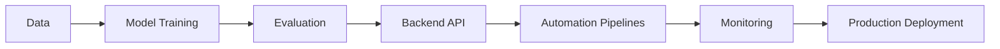
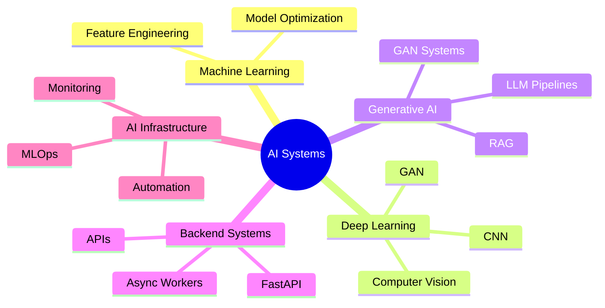
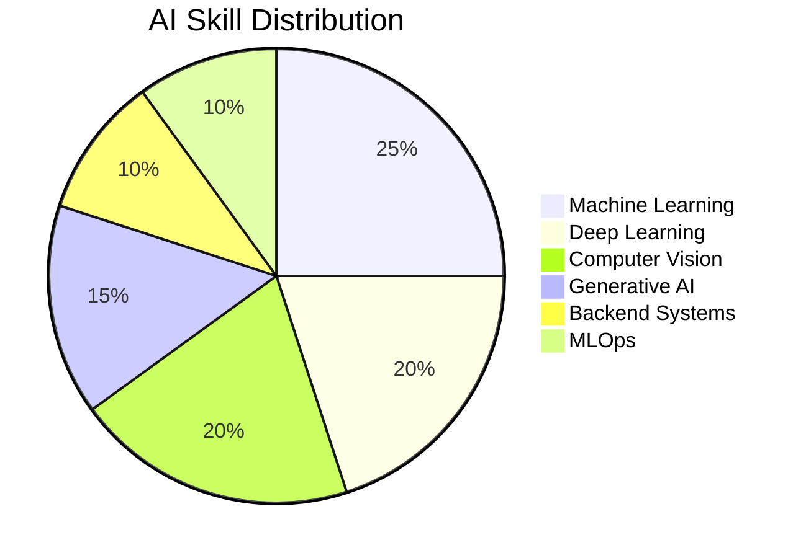
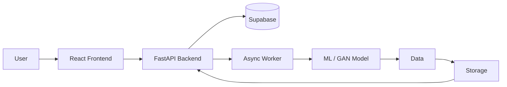

# 🔥 Sivaraj V

### AI Engineer • Machine Learning Engineer • AI Systems Developer

<p align="center">


</p>

---

# 👋 About Me

I’m **Sivaraj V**, a final-year Computer Science student who builds **real AI systems end-to-end**.

Not just:

```
train model → accuracy → done
```

But full systems:

```
data → model → backend → automation → monitoring → deployment
```

I specialize in:

* Machine Learning Systems
* Computer Vision
* Generative AI
* AI Backend Infrastructure
* Automation & AI Agents
* Production ML APIs

I’ve worked with **Zoho Corporation** and **Infosys Springboard** building real engineering solutions.

I’m currently **open to AI / ML Engineer roles**.

---

# 🚀 Engineering Philosophy



I focus on **AI products that actually run in production**.

---

# 🧠 Core Expertise



---

# 🧰 Tech Stack

## Programming

```
Python • Java • JavaScript • SQL
```

---

## Machine Learning

```
PyTorch
TensorFlow
Scikit-learn
Deep Learning
Computer Vision
GANs
NLP
LLMs
RAG
```

---

## Backend & Systems

```
FastAPI
REST APIs
Async Processing
Workers
Automation Pipelines
```

---

## Data & AI Tools

```
Pandas
NumPy
Matplotlib
Seaborn
FAISS
LangChain
Transformers
```

---

## Cloud & DevOps

```
Docker
CI/CD
GitHub Actions
Vercel
Render
Supabase
```

---

# 📊 GitHub Analytics

<p align="center">


</p>

---

# 📈 Activity Graph

<p align="center">


</p>

---

# 🧠 AI Skill Radar



---
📈 Contribution Activity
<p align="center">  </p>
🐉 Dragon Hunting My Commits
<p align="center">  </p>
📊 GitHub Contribution Summary
<p align="center">  </p> 


# 🧪 Featured Projects

| Project                           | Description                                                                               | Tech                          | Live                                                          |
| --------------------------------- | ----------------------------------------------------------------------------------------- | ----------------------------- | ------------------------------------------------------------- |
| **Personix AI**                   | Synthetic human dataset generation platform with automated packaging and inventory system | FastAPI, React, GAN, Supabase | https://personix-ai.vercel.app                                |
| **PCB Defect Detection System**   | AI-based automated optical inspection system for PCB manufacturing                        | PyTorch, OpenCV, Streamlit    | https://huggingface.co/spaces/SivarajV28/pcb-defect-inspector |
| **GAN Synthetic Face Generator**  | Generative AI system producing synthetic human faces for privacy-safe datasets            | TensorFlow, GAN               | —                                                             |
| **Diabetes Prediction ML System** | ML pipeline achieving **91.45% accuracy** using Gradient Boosting                         | Scikit-learn                  | —                                                             |
| **Movie Genre Classification**    | NLP multi-label classification system for movie metadata                                  | NLP, Scikit-learn             | —                                                             |
| **Spam & Fraud Detection**        | ML models detecting spam SMS and financial fraud patterns                                 | ML                            | —                                                             |

---

# 🏗️ AI System Architecture Example



---

# 🏭 Industrial AI Pipeline


---

# 📬 Connect With Me

LinkedIn
https://www.linkedin.com/in/sivarajvofficial

Portfolio
https://sivarajv04.github.io/sivaraj-portfolio/

GitHub
https://github.com/sivarajv04

Email
[sivarajvofficial@gmail.com](mailto:sivarajvofficial@gmail.com)

---

# ⚡ Fun Fact

I enjoy engineering **complete AI systems from scratch** —
from **training models → designing architecture → deploying real products**.

---

⭐ If you like my work, consider **following me on GitHub**.
