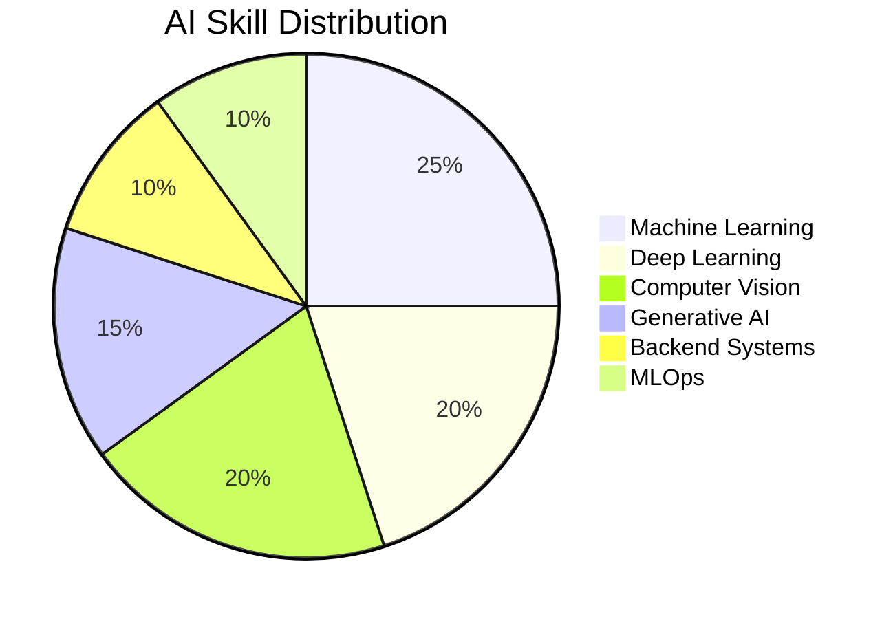
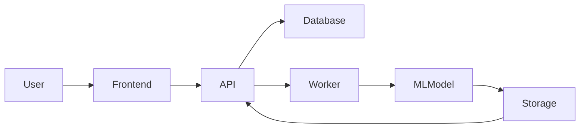
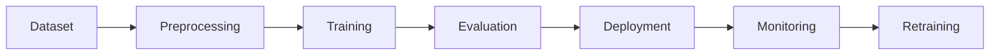

# 🔥 Sivaraj — AI Engineer

<p align="center">


</p>


<p align="center">


</p>


---

# 🔴 Contribution Activity

<p align="center">


</p>


<p align="center">


</p>


---

# 🔴 About Me

I’m **Sivaraj V**, an AI/ML engineer focused on building **real production-grade AI systems**.

Most machine learning projects end at:

```

train model → accuracy → done

```

My focus is **complete AI systems**:

```

data → model → backend → automation → monitoring → deployment

````

### Areas I work in

- Machine Learning Systems
- Computer Vision
- Generative AI
- AI Infrastructure
- Automation & AI Agents
- Production ML APIs

Experience includes:

- **Zoho Corporation — Software Developer Intern**
- **Infosys Springboard — AI / ML Intern**

Currently **open to AI Engineer / Machine Learning Engineer roles.**

---

# 🔴 Engineering Philosophy

```mermaid
flowchart LR

Data --> Training
Training --> Evaluation
Evaluation --> Backend
Backend --> Automation
Automation --> Monitoring
Monitoring --> Production
````

I build **AI products that actually run in production**.

---

# 🔴 Core Expertise

```mermaid
mindmap
root((AI Systems))
  Machine Learning
    Feature Engineering
    Model Optimization
  Deep Learning
    CNN
    GAN
    Computer Vision
  Generative AI
    LLM Pipelines
    RAG
  Backend Systems
    FastAPI
    APIs
  Infrastructure
    MLOps
    Monitoring
```

---

# 🔴 Tech Stack

### Programming

```
Python • Java • JavaScript • SQL
```

### Machine Learning

```
PyTorch
TensorFlow
Scikit-learn
Computer Vision
GANs
NLP
LLMs
RAG
```

### Backend

```
FastAPI
REST APIs
Async Workers
Automation Pipelines
```

### Data

```
Pandas
NumPy
Matplotlib
Seaborn
FAISS
LangChain
Transformers
```

### Cloud / DevOps

```
Docker
GitHub Actions
CI/CD
Vercel
Render
Supabase
```

---

# 🔴 GitHub Analytics

<p align="center">


</p>

---


## 🔴 Dragon Hunting My Commits

<p align="center">


</p>

---

# 🔴 GitHub Contribution Summary

<p align="center">


</p>

---

# 🔴 AI Skill Radar



---

# 🔴 Featured Projects

| Project                         | Description                                                                               | Tech                          | Demo                                                                                                                           |
| ------------------------------- | ----------------------------------------------------------------------------------------- | ----------------------------- | ------------------------------------------------------------------------------------------------------------------------------ |
| **Personix AI**                 | Synthetic human dataset generation platform with automated packaging and inventory system | FastAPI, React, GAN, Supabase | [https://personix-ai.vercel.app](https://personix-ai.vercel.app)                                                               |
| **PCB Defect Detection System** | AI-based automated optical inspection system for PCB manufacturing                        | PyTorch, OpenCV               | [https://huggingface.co/spaces/SivarajV28/pcb-defect-inspector](https://huggingface.co/spaces/SivarajV28/pcb-defect-inspector) |
| **Synthetic Face Generator**    | GAN system generating privacy-safe human faces                                            | TensorFlow                    | —                                                                                                                              |
| **Diabetes Prediction System**  | ML pipeline achieving **91.45% accuracy**                                                 | Scikit-learn                  | —                                                                                                                              |
| **Movie Genre Classification**  | NLP multi-label classification model                                                      | NLP                           | —                                                                                                                              |
| **Spam & Fraud Detection**      | ML models detecting financial fraud and spam                                              | ML                            | —                                                                                                                              |

---

# 🔴 AI System Architecture



---

# 🔴 Industrial AI Pipeline



---

# 🔴 Connect With Me

**LinkedIn**

[https://www.linkedin.com/in/sivarajvofficial](https://www.linkedin.com/in/sivarajvofficial)

**Portfolio**

[https://sivarajv04.github.io/sivaraj-portfolio](https://sivarajv04.github.io/sivaraj-portfolio)

**GitHub**

[https://github.com/sivarajv04](https://github.com/sivarajv04)

**Email**

[sivarajvofficial@gmail.com](mailto:sivarajvofficial@gmail.com)

---

# 🔴 Fun Fact

I enjoy engineering **complete AI systems from scratch**:

```
model training
system architecture
backend engineering
deployment
```

---

⭐ If you like my work, consider **starring my repositories or following me on GitHub**.

```
